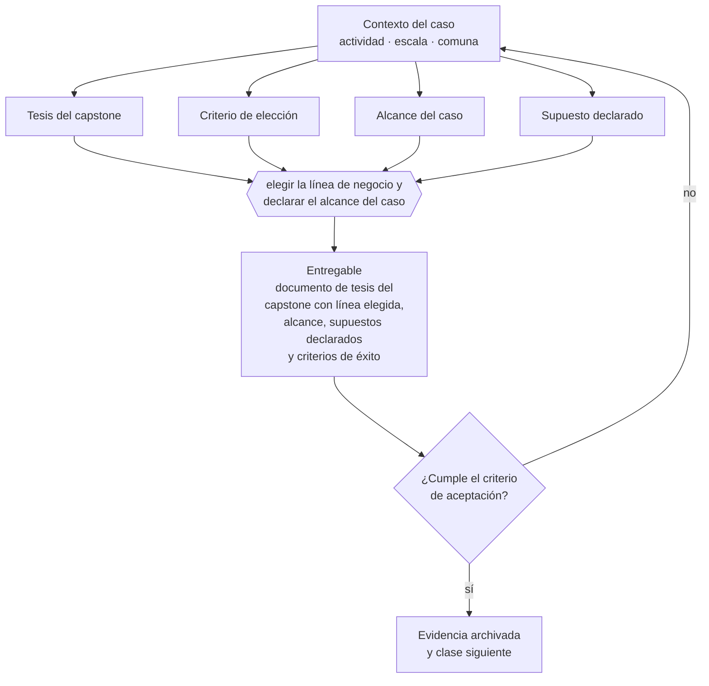

# Clase 323 — Elegir tesis y línea de negocio

> **Parte 24 · Capstone: construir una empresa de comienzo a fin** — clase 1 de 14

**Estado de evidencia:** `GUIA-PRACTICA` · **Jurisdicción:** Chile-first · **Fecha base normativa:** 07-08-2026 
**Decisión que habilita:** elegir la línea de negocio y declarar el alcance del caso 
**Entregable:** documento de tesis del capstone con línea elegida, alcance, supuestos declarados y criterios de éxito

## 🎯 Propósito

Elegir una línea de negocio con fuentes accesibles y declarar el alcance del caso, para que el capstone sea verificable y no especulativo.

## 📚 Resultados de aprendizaje

Al finalizar esta clase podrás:

1. **Definir** con precisión los cuatro conceptos de la tabla siguiente y usarlos para describir un caso real.
2. **Explicar** por qué esta materia condiciona decisiones de otras partes del programa.
3. **Decidir** —elegir la línea de negocio y declarar el alcance del caso— y justificar la decisión por escrito.
4. **Producir** el entregable de la clase y contrastarlo contra su criterio de aceptación.
5. **Distinguir** el dato estable del dato dinámico que exige revalidación en la fuente oficial.

## 🧩 Conceptos centrales

| Concepto | Comprensión verificable |
|---|---|
| **Tesis del capstone** | Apuesta empresarial que se desarrollará de principio a fin. |
| **Criterio de elección** | Factores que hacen viable el caso para el estudiante. |
| **Alcance del caso** | Límites del ejercicio: geografía, escala y línea. |
| **Supuesto declarado** | Afirmación que el caso asume y que debe verificarse. |

## 🗺️ Flujo de razonamiento

## 📖 Desarrollo

### 1. El fondo del asunto

El capstone se construye sobre un caso único que atraviesa todas las partes del programa. Elegir una línea con carga regulatoria conocida y datos accesibles hace el ejercicio verificable; elegir una demasiado exótica lo convierte en especulación sin fuentes.

### 2. Cómo se traduce en la práctica

Una línea con carga regulatoria conocida y datos públicos permite contrastar cada afirmación; una demasiado exótica convierte el ejercicio en ficción bien redactada. Y dejar el alcance abierto impide cerrar el caso: la geografía, la escala y el horizonte deben fijarse desde el inicio.

### 3. Marco aplicable y quién interviene

- integración de todas las partes anteriores del programa
- criterio de defensa: coherencia entre decisiones, evidencia y caja
- trazabilidad a fuente oficial en cada afirmación regulatoria

**Autoridades o contrapartes involucradas:** todas las anteriores según la línea de negocio elegida.
**Profesionales de apoyo:** fundador, contador, abogado, especialista sectorial. La participación concreta depende del riesgo, del
tamaño de la empresa y de la actividad económica.

## 🧪 Taller guiado

Aplica esta clase a **una** de las siguientes líneas de negocio y repite después el ejercicio con
una segunda línea de carga regulatoria distinta:

| Línea | Carga regulatoria |
|---|---|
| SaaS B2B con IA | media |
| Servicios profesionales | baja |
| E-commerce D2C | media |
| Alimentos o foodtech | alta |
| Exportación de servicios | media |
| Fintech regulada | alta |
| Construcción o servicios técnicos | alta |

**Secuencia de trabajo:**

1. Delimita el contexto: actividad económica, escala, comuna y etapa de la empresa.
2. Reúne los antecedentes que la decisión exige y anota la fecha de cada fuente.
3. Identifica las alternativas reales, incluida la de no hacer nada.
4. Evalúa el impacto en mercado, caja, personas, regulación y operación.
5. Toma la decisión y regístrala con sus supuestos.
6. Produce el entregable.
7. Contrástalo contra el criterio de aceptación.
8. Anota lo que requiere validación profesional y programa su revisión.

### 📦 Entregable

Documento de tesis del capstone con línea elegida, alcance, supuestos declarados y criterios de éxito.

Debe incluir decisión, supuestos, fuentes con fecha de consulta, responsable, riesgos
identificados y próximos pasos.

## 🏆 Reto verificable

Resuelve la misma materia para una segunda línea de negocio con distinta carga regulatoria y
explica por escrito **qué cambió, por qué y qué fuente lo determina**.

## ✅ Criterio de aceptación

- [ ] la línea elegida tiene fuentes oficiales verificables
- [ ] el alcance y los supuestos están declarados por escrito
- [ ] cada afirmación regulatoria está referida a una fuente oficial con fecha de consulta;
- [ ] los datos dinámicos quedan marcados para revalidación;
- [ ] hay un responsable asignado y evidencia reproducible del trabajo.

## ⚠️ Errores frecuentes

**Propios de esta clase:**

- Elegir una línea sin fuentes accesibles para verificar su regulación.
- Dejar el alcance abierto y no poder cerrar el caso.

**Característicos de la parte 24:**

- Producir documentos bonitos sin coherencia numérica entre ellos.
- Copiar el caso de otra empresa sin adaptar actividad, comuna ni escala.

## 🇨🇱 Checklist Chile

- [ ] ¿existe norma o autoridad específica para esta materia?
- [ ] ¿la fuente consultada está vigente a la fecha de ejecución?
- [ ] ¿se activa algún trámite ante el SII?
- [ ] ¿se activa algún requisito municipal o sectorial?
- [ ] ¿afecta a consumidores o al tratamiento de datos personales?
- [ ] ¿afecta a trabajadores o a la seguridad y salud en el trabajo?
- [ ] ¿afecta a impuestos, contabilidad o caja?
- [ ] ¿afecta a contratos o a propiedad intelectual?
- [ ] ¿requiere renovación, reporte periódico o revalidación?

## ❓ Preguntas de comprobación

1. ¿Qué fuentes oficiales existen para verificar la regulación de tu línea?
2. ¿Qué alcance —comuna, escala, horizonte— declaras para el caso?
3. ¿Qué supuestos asumes desde ya como no verificados?

## 🔗 Fuentes oficiales

**Servicio de Impuestos Internos — Nuevos contribuyentes, inicio de actividades y DTE**  
<https://www.sii.cl/ayudas/nuevos_contribuyentes/boleta-vys-facturador.html> · verificado 2026-08-07

- *Qué contiene:* Reúne el circuito completo del contribuyente nuevo: obtención de RUT, declaración de inicio de actividades, elección de códigos de actividad económica y habilitación para emitir documentos tributarios electrónicos.
- *Cómo leerla:* Sepáralo en dos actos distintos que la página trata seguidos: el RUT identifica, el inicio de actividades habilita. Lo que te bloquea para facturar casi siempre está en el segundo, no en el primero.

**Biblioteca del Congreso Nacional · LeyChile — Normativa oficial consolidada**  
<https://www.bcn.cl/leychile/> · verificado 2026-08-07

- *Qué contiene:* Publica el texto oficial y consolidado de leyes, decretos y reglamentos, con la versión vigente a una fecha, el historial de modificaciones y la tramitación que las originó.
- *Cómo leerla:* Usa siempre el selector de versión vigente a la fecha en que ejecutarás el trámite, no la última publicada. Y lee el artículo transitorio: en normas en implantación gradual —jornada, datos personales— ahí está la fecha que realmente te aplica.

Complementos del repositorio: [glosario](../../../docs/19_GLOSSARY.md) ·
[ruta de lecturas](../../../docs/15_BOOKS_AND_LEARNING_PATH.md) ·
[catálogo de fuentes](../../../docs/16_OFFICIAL_SOURCE_CATALOG.md).

> [!IMPORTANT]
> Material educativo. Para una decisión real de alto impacto hay que verificar la fuente oficial
> vigente y validar con el profesional competente.

---

| Anterior | Índice | Siguiente |
|---|---|---|
| **Inicio de la parte** | [Parte 24](../README.md) · [Programa](../../../README.md) | [324 · Validar problema, cliente y disposición a pagar →](../class-02-validar-problema-cliente-y-disposicion-a-pagar/README.md) |
