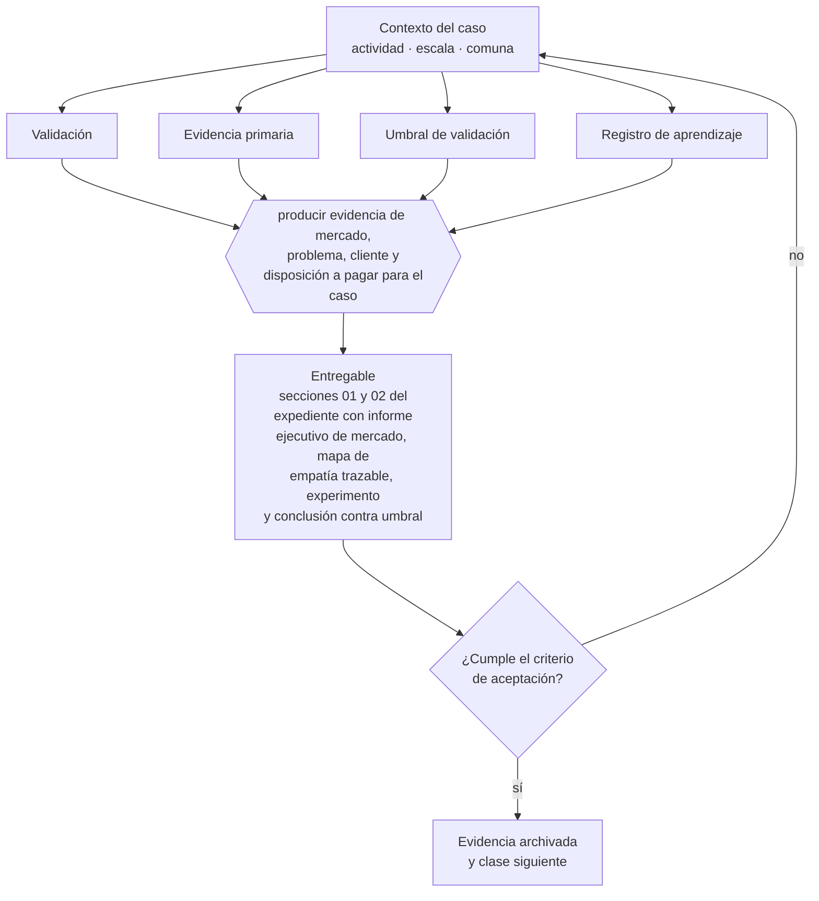

# Clase 324 — Validar problema, cliente y disposición a pagar

> **Parte 24 · Capstone: construir una empresa de comienzo a fin** — clase 2 de 14

**Estado de evidencia:** `GUIA-PRACTICA` · **Jurisdicción:** Chile-first · **Fecha base normativa:** 07-08-2026 
**Decisión que habilita:** producir evidencia de mercado, problema, cliente y disposición a pagar para el caso 
**Entregable:** secciones 01 y 02 del expediente con informe ejecutivo de mercado, mapa de empatía trazable, experimento y conclusión contra umbral

## 🎯 Propósito

Completar mercado y cliente con evidencia trazable, sin convertir investigación secundaria ni interpretación en validación.

## 📚 Resultados de aprendizaje

Al finalizar esta clase podrás:

1. **Definir** con precisión los cuatro conceptos de la tabla siguiente y usarlos para describir un caso real.
2. **Explicar** por qué esta materia condiciona decisiones de otras partes del programa.
3. **Decidir** —producir evidencia de mercado, problema, cliente y disposición a pagar para el caso— y justificar la decisión por escrito.
4. **Producir** el entregable de la clase y contrastarlo contra su criterio de aceptación.
5. **Distinguir** el dato estable del dato dinámico que exige revalidación en la fuente oficial.

## 🧩 Conceptos centrales

| Concepto | Comprensión verificable |
|---|---|
| **Validación** | Evidencia de que el problema y la disposición a pagar existen. |
| **Evidencia primaria** | Dato obtenido directamente del mercado. |
| **Umbral de validación** | Criterio fijado antes de recolectar evidencia. |
| **Registro de aprendizaje** | Bitácora de lo confirmado y lo refutado. |

## 🗺️ Flujo de razonamiento

## 📖 Desarrollo

### 1. El fondo del asunto

Esta etapa completa las secciones 01 Mercado y 02 Cliente del expediente con investigación secundaria, entrevistas, alternativas actuales, TAM/SAM/SOM, competencia y experimento de demanda. Lo que se evalúa no es que el resultado sea positivo, sino que el método permita distinguir evidencia del cliente, hipótesis del equipo e interpretación, y que el informe ejecutivo declare fuentes, fechas, supuestos, confianza y preguntas abiertas.

### 2. Cómo se traduce en la práctica

El informe ejecutivo reúne definición, segmento, TAM/SAM/SOM, tendencias, competencia, benchmarks, barreras y preguntas abiertas. El mapa del cliente registra qué intenta lograr, observa, escucha, piensa, siente y hace desde citas y conductas. Lo que se evalúa es poder separar evidencia, hipótesis e interpretación aunque la conclusión sea negativa.

### 3. Marco aplicable y quién interviene

- integración de todas las partes anteriores del programa
- criterio de defensa: coherencia entre decisiones, evidencia y caja
- trazabilidad a fuente oficial en cada afirmación regulatoria

**Autoridades o contrapartes involucradas:** todas las anteriores según la línea de negocio elegida.
**Profesionales de apoyo:** fundador, contador, abogado, especialista sectorial. La participación concreta depende del riesgo, del
tamaño de la empresa y de la actividad económica.

## 🧪 Taller guiado

Aplica esta clase a **una** de las siguientes líneas de negocio y repite después el ejercicio con
una segunda línea de carga regulatoria distinta:

| Línea | Carga regulatoria |
|---|---|
| SaaS B2B con IA | media |
| Servicios profesionales | baja |
| E-commerce D2C | media |
| Alimentos o foodtech | alta |
| Exportación de servicios | media |
| Fintech regulada | alta |
| Construcción o servicios técnicos | alta |

**Secuencia de trabajo:**

1. Delimita el contexto: actividad económica, escala, comuna y etapa de la empresa.
2. Reúne los antecedentes que la decisión exige y anota la fecha de cada fuente.
3. Identifica las alternativas reales, incluida la de no hacer nada.
4. Evalúa el impacto en mercado, caja, personas, regulación y operación.
5. Toma la decisión y regístrala con sus supuestos.
6. Produce el entregable.
7. Contrástalo contra el criterio de aceptación.
8. Anota lo que requiere validación profesional y programa su revisión.

### 📦 Entregable

Secciones 01 y 02 del expediente con informe ejecutivo de mercado, mapa de empatía trazable, experimento y conclusión contra umbral.

Debe incluir decisión, supuestos, fuentes con fecha de consulta, responsable, riesgos
identificados y próximos pasos.

## 🏆 Reto verificable

Resuelve la misma materia para una segunda línea de negocio con distinta carga regulatoria y
explica por escrito **qué cambió, por qué y qué fuente lo determina**.

## ✅ Criterio de aceptación

- [ ] existe evidencia primaria documentada y separada de hipótesis e interpretación
- [ ] el informe de mercado no contiene cifras sin fuente o marca de supuesto
- [ ] el umbral estaba definido antes de la recolección
- [ ] cada afirmación regulatoria está referida a una fuente oficial con fecha de consulta;
- [ ] los datos dinámicos quedan marcados para revalidación;
- [ ] hay un responsable asignado y evidencia reproducible del trabajo.

## ⚠️ Errores frecuentes

**Propios de esta clase:**

- Presentar validación con evidencia secundaria únicamente.
- Convertir la interpretación del equipo en evidencia del cliente.

**Característicos de la parte 24:**

- Producir documentos bonitos sin coherencia numérica entre ellos.
- Copiar el caso de otra empresa sin adaptar actividad, comuna ni escala.

## 🇨🇱 Checklist Chile

- [ ] ¿existe norma o autoridad específica para esta materia?
- [ ] ¿la fuente consultada está vigente a la fecha de ejecución?
- [ ] ¿se activa algún trámite ante el SII?
- [ ] ¿se activa algún requisito municipal o sectorial?
- [ ] ¿afecta a consumidores o al tratamiento de datos personales?
- [ ] ¿afecta a trabajadores o a la seguridad y salud en el trabajo?
- [ ] ¿afecta a impuestos, contabilidad o caja?
- [ ] ¿afecta a contratos o a propiedad intelectual?
- [ ] ¿requiere renovación, reporte periódico o revalidación?

## ❓ Preguntas de comprobación

1. ¿Cada cifra de mercado tiene fuente o está marcada como supuesto?
2. ¿Qué evidencia respalda cada afirmación del mapa del cliente?
3. ¿Qué umbral fijado de antemano determina la conclusión de las secciones 01 y 02?

## 🔗 Fuentes oficiales

**Registro de Empresas y Sociedades / ChileAtiende — Constitución de empresas**  
<https://www.chileatiende.gob.cl/fichas/21409-tu-empresa> · verificado 2026-08-19

- *Qué contiene:* Describe el régimen simplificado de la Ley 20.659: qué tipos societarios admite el formulario electrónico, quiénes deben firmar, qué documentos entrega el sistema y cómo se hacen después las modificaciones.
- *Cómo leerla:* Entra por el tipo societario que ya elegiste, no al revés. La ficha dice qué campos pide el formulario; si tu estatuto necesita una cláusula que el formulario no soporta, la respuesta es la ruta notarial.
- *Uso en esta clase:* aporta el marco de «Constitución de empresas» para producir evidencia de mercado, problema, cliente y disposición a pagar para el caso.

**Servicio de Impuestos Internos — Nuevos contribuyentes, inicio de actividades y DTE**  
<https://www.sii.cl/ayudas/nuevos_contribuyentes/boleta-vys-facturador.html> · verificado 2026-10-01

- *Qué contiene:* Reúne el circuito completo del contribuyente nuevo: obtención de RUT, declaración de inicio de actividades, elección de códigos de actividad económica y habilitación para emitir documentos tributarios electrónicos.
- *Cómo leerla:* Sepáralo en dos actos distintos que la página trata seguidos: el RUT identifica, el inicio de actividades habilita. Lo que te bloquea para facturar casi siempre está en el segundo, no en el primero.
- *Uso en esta clase:* aporta el marco de «Nuevos contribuyentes, inicio de actividades y DTE» para producir evidencia de mercado, problema, cliente y disposición a pagar para el caso.

**Servicio de Impuestos Internos — Regímenes tributarios · Operación Renta 2026**  
<https://www.sii.cl/destacados/renta/2026/intermediarios/regimenes_tributarios/> · verificado 2026-10-01

- *Qué contiene:* Compara los regímenes vigentes: requisitos de ingreso y permanencia, tipo de propietarios admitidos, forma de determinar la base imponible y cómo se imputa el crédito contra los impuestos finales de los dueños.
- *Cómo leerla:* Lee primero la columna de requisitos de propietarios: descarta regímenes antes de comparar tasas. Las tasas cambian por ley y por período transitorio, así que anota la fecha de consulta junto a cada cifra que uses.
- *Uso en esta clase:* aporta el marco de «Regímenes tributarios · Operación Renta 2026» para producir evidencia de mercado, problema, cliente y disposición a pagar para el caso.

Complementos del repositorio: [glosario](../../../docs/19_GLOSSARY.md) ·
[ruta de lecturas](../../../docs/15_BOOKS_AND_LEARNING_PATH.md) ·
[catálogo de fuentes](../../../docs/16_OFFICIAL_SOURCE_CATALOG.md).

> [!IMPORTANT]
> Material educativo. Para una decisión real de alto impacto hay que verificar la fuente oficial
> vigente y validar con el profesional competente.

---

| Anterior | Índice | Siguiente |
|---|---|---|
| [← 323 · Elegir tesis y línea de negocio](../class-01-elegir-tesis-y-linea-de-negocio/README.md) | [Parte 24](../README.md) · [Programa](../../../README.md) | [325 · Diseñar modelo de negocio y estrategia →](../class-03-disenar-modelo-de-negocio-y-estrategia/README.md) |
