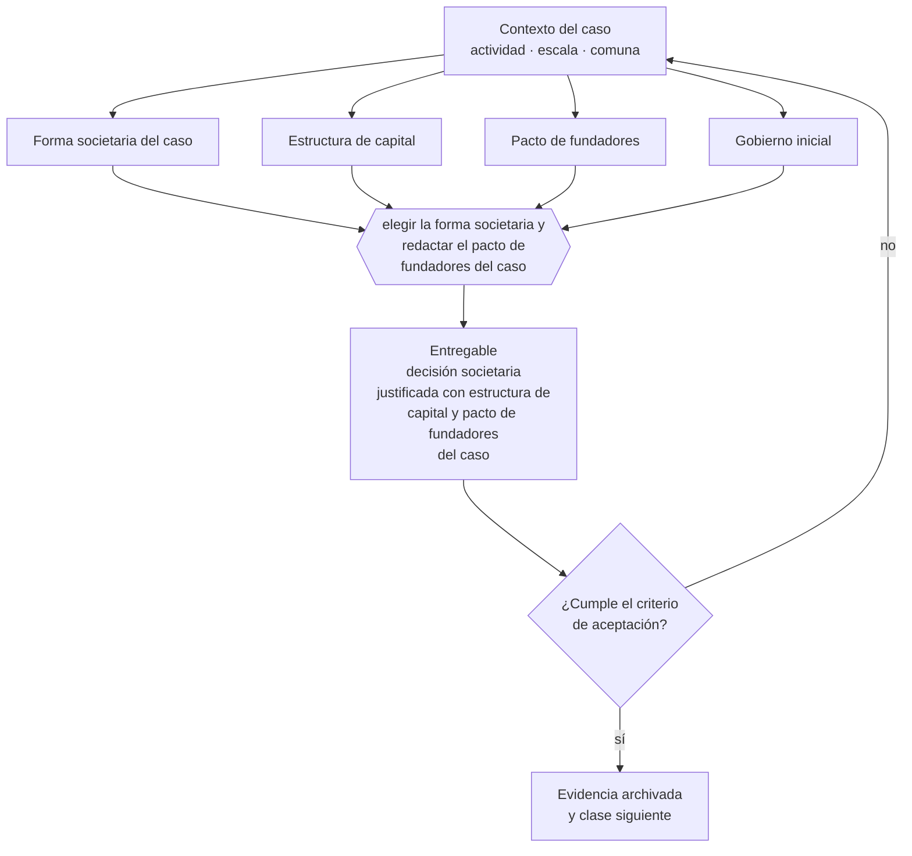

# Clase 326 — Elegir sociedad y diseñar pacto de fundadores

> **Parte 24 · Capstone: construir una empresa de comienzo a fin** — clase 4 de 14

**Estado de evidencia:** `GUIA-PRACTICA` · **Jurisdicción:** Chile-first · **Fecha base normativa:** 07-08-2026 
**Decisión que habilita:** elegir la forma societaria y redactar el pacto de fundadores del caso 
**Entregable:** decisión societaria justificada con estructura de capital y pacto de fundadores del caso

## 🎯 Propósito

Elegir la forma societaria del caso justificándola contra alternativas y redactar el pacto de fundadores completo.

## 📚 Resultados de aprendizaje

Al finalizar esta clase podrás:

1. **Definir** con precisión los cuatro conceptos de la tabla siguiente y usarlos para describir un caso real.
2. **Explicar** por qué esta materia condiciona decisiones de otras partes del programa.
3. **Decidir** —elegir la forma societaria y redactar el pacto de fundadores del caso— y justificar la decisión por escrito.
4. **Producir** el entregable de la clase y contrastarlo contra su criterio de aceptación.
5. **Distinguir** el dato estable del dato dinámico que exige revalidación en la fuente oficial.

## 🧩 Conceptos centrales

| Concepto | Comprensión verificable |
|---|---|
| **Forma societaria del caso** | Vehículo elegido con su justificación. |
| **Estructura de capital** | Reparto entre fundadores y espacio para inversionistas. |
| **Pacto de fundadores** | Reglas de vesting, salida y conflicto. |
| **Gobierno inicial** | Ritmo y registro de decisiones. |

## 🗺️ Flujo de razonamiento

## 📖 Desarrollo

### 1. El fondo del asunto

Esta etapa traduce el modelo en una estructura jurídica: tipo societario, capital, control y reglas entre socios. La evaluación revisa que la elección tenga justificación explícita y que el pacto cubra los escenarios que rompen sociedades.

### 2. Cómo se traduce en la práctica

La justificación debe usar los cuatro criterios de la parte 05 y no la costumbre. Y el pacto debe cubrir vesting, salida, muerte, incumplimiento, competencia y mecanismo de resolución de conflictos: omitir cualquiera deja el escenario correspondiente sin regla.

### 3. Marco aplicable y quién interviene

- integración de todas las partes anteriores del programa
- criterio de defensa: coherencia entre decisiones, evidencia y caja
- trazabilidad a fuente oficial en cada afirmación regulatoria

**Autoridades o contrapartes involucradas:** todas las anteriores según la línea de negocio elegida.
**Profesionales de apoyo:** fundador, contador, abogado, especialista sectorial. La participación concreta depende del riesgo, del
tamaño de la empresa y de la actividad económica.

## 🧪 Taller guiado

Aplica esta clase a **una** de las siguientes líneas de negocio y repite después el ejercicio con
una segunda línea de carga regulatoria distinta:

| Línea | Carga regulatoria |
|---|---|
| SaaS B2B con IA | media |
| Servicios profesionales | baja |
| E-commerce D2C | media |
| Alimentos o foodtech | alta |
| Exportación de servicios | media |
| Fintech regulada | alta |
| Construcción o servicios técnicos | alta |

**Secuencia de trabajo:**

1. Delimita el contexto: actividad económica, escala, comuna y etapa de la empresa.
2. Reúne los antecedentes que la decisión exige y anota la fecha de cada fuente.
3. Identifica las alternativas reales, incluida la de no hacer nada.
4. Evalúa el impacto en mercado, caja, personas, regulación y operación.
5. Toma la decisión y regístrala con sus supuestos.
6. Produce el entregable.
7. Contrástalo contra el criterio de aceptación.
8. Anota lo que requiere validación profesional y programa su revisión.

### 📦 Entregable

Decisión societaria justificada con estructura de capital y pacto de fundadores del caso.

Debe incluir decisión, supuestos, fuentes con fecha de consulta, responsable, riesgos
identificados y próximos pasos.

## 🏆 Reto verificable

Resuelve la misma materia para una segunda línea de negocio con distinta carga regulatoria y
explica por escrito **qué cambió, por qué y qué fuente lo determina**.

## ✅ Criterio de aceptación

- [ ] la elección societaria está justificada contra alternativas
- [ ] el pacto cubre vesting, salida y conflicto
- [ ] cada afirmación regulatoria está referida a una fuente oficial con fecha de consulta;
- [ ] los datos dinámicos quedan marcados para revalidación;
- [ ] hay un responsable asignado y evidencia reproducible del trabajo.

## ⚠️ Errores frecuentes

**Propios de esta clase:**

- Elegir el vehículo por costumbre sin justificar contra alternativas.
- Omitir vesting y mecanismo de resolución de conflictos.

**Característicos de la parte 24:**

- Producir documentos bonitos sin coherencia numérica entre ellos.
- Copiar el caso de otra empresa sin adaptar actividad, comuna ni escala.

## 🇨🇱 Checklist Chile

- [ ] ¿existe norma o autoridad específica para esta materia?
- [ ] ¿la fuente consultada está vigente a la fecha de ejecución?
- [ ] ¿se activa algún trámite ante el SII?
- [ ] ¿se activa algún requisito municipal o sectorial?
- [ ] ¿afecta a consumidores o al tratamiento de datos personales?
- [ ] ¿afecta a trabajadores o a la seguridad y salud en el trabajo?
- [ ] ¿afecta a impuestos, contabilidad o caja?
- [ ] ¿afecta a contratos o a propiedad intelectual?
- [ ] ¿requiere renovación, reporte periódico o revalidación?

## ❓ Preguntas de comprobación

1. ¿Por qué ese vehículo y no los otros tres, con qué criterio ponderado?
2. ¿Qué pasa si un fundador se va a los ocho meses?
3. ¿Cómo se resuelve un empate en una decisión estructural?

## 🔗 Fuentes oficiales

**Registro de Empresas y Sociedades / ChileAtiende — Constitución de empresas**  
<https://www.chileatiende.gob.cl/fichas/21409-tu-empresa> · verificado 2026-08-19

- *Qué contiene:* Describe el régimen simplificado de la Ley 20.659: qué tipos societarios admite el formulario electrónico, quiénes deben firmar, qué documentos entrega el sistema y cómo se hacen después las modificaciones.
- *Cómo leerla:* Entra por el tipo societario que ya elegiste, no al revés. La ficha dice qué campos pide el formulario; si tu estatuto necesita una cláusula que el formulario no soporta, la respuesta es la ruta notarial.
- *Uso en esta clase:* aporta el marco de «Constitución de empresas» para elegir la forma societaria y redactar el pacto de fundadores del caso.

**Biblioteca del Congreso Nacional · LeyChile — Normativa oficial consolidada**  
<https://www.bcn.cl/leychile/> · verificado 2026-08-19

- *Qué contiene:* Publica el texto oficial y consolidado de leyes, decretos y reglamentos, con la versión vigente a una fecha, el historial de modificaciones y la tramitación que las originó.
- *Cómo leerla:* Usa siempre el selector de versión vigente a la fecha en que ejecutarás el trámite, no la última publicada. Y lee el artículo transitorio: en normas en implantación gradual —jornada, datos personales— ahí está la fecha que realmente te aplica.
- *Uso en esta clase:* aporta el marco de «Normativa oficial consolidada» para elegir la forma societaria y redactar el pacto de fundadores del caso.

Complementos del repositorio: [glosario](../../../docs/19_GLOSSARY.md) ·
[ruta de lecturas](../../../docs/15_BOOKS_AND_LEARNING_PATH.md) ·
[catálogo de fuentes](../../../docs/16_OFFICIAL_SOURCE_CATALOG.md).

> [!IMPORTANT]
> Material educativo. Para una decisión real de alto impacto hay que verificar la fuente oficial
> vigente y validar con el profesional competente.

---

| Anterior | Índice | Siguiente |
|---|---|---|
| [← 325 · Diseñar modelo de negocio y estrategia](../class-03-disenar-modelo-de-negocio-y-estrategia/README.md) | [Parte 24](../README.md) · [Programa](../../../README.md) | [327 · Simular constitución y carpeta legal →](../class-05-simular-constitucion-y-carpeta-legal/README.md) |
