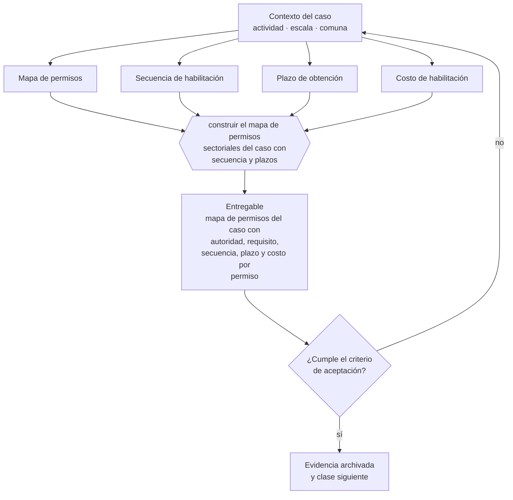

# Clase 331 — Crear mapa de permisos sectoriales

> **Parte 24 · Capstone: construir una empresa de comienzo a fin** — clase 9 de 14

**Estado de evidencia:** `GUIA-PRACTICA` · **Jurisdicción:** Chile-first · **Fecha base normativa:** 07-08-2026 
**Decisión que habilita:** construir el mapa de permisos sectoriales del caso con secuencia y plazos 
**Entregable:** mapa de permisos del caso con autoridad, requisito, secuencia, plazo y costo por permiso

## 🎯 Propósito

Construir el mapa de permisos con la secuencia real de dependencias y los plazos incorporados al cronograma del proyecto.

## 📚 Resultados de aprendizaje

Al finalizar esta clase podrás:

1. **Definir** con precisión los cuatro conceptos de la tabla siguiente y usarlos para describir un caso real.
2. **Explicar** por qué esta materia condiciona decisiones de otras partes del programa.
3. **Decidir** —construir el mapa de permisos sectoriales del caso con secuencia y plazos— y justificar la decisión por escrito.
4. **Producir** el entregable de la clase y contrastarlo contra su criterio de aceptación.
5. **Distinguir** el dato estable del dato dinámico que exige revalidación en la fuente oficial.

## 🧩 Conceptos centrales

| Concepto | Comprensión verificable |
|---|---|
| **Mapa de permisos** | Inventario de habilitaciones exigidas por la actividad. |
| **Secuencia de habilitación** | Orden en que los permisos se condicionan. |
| **Plazo de obtención** | Tiempo estimado de cada trámite. |
| **Costo de habilitación** | Desembolso total para poder operar. |

## 🗺️ Flujo de razonamiento

## 📖 Desarrollo

### 1. El fondo del asunto

El mapa de permisos del caso debe ser específico: municipio, actividad, sector. La evaluación revisa que la secuencia respete las dependencias reales —uso de suelo antes de patente, resolución sanitaria antes de operar— y que los plazos estén incorporados al plan.

### 2. Cómo se traduce en la práctica

Uso de suelo antes de patente, resolución sanitaria antes de operar: la secuencia no es negociable y define el cronograma más que la obra. Listar permisos sin verificar cuáles condicionan a cuáles produce un plan que se rompe en la primera dependencia.

### 3. Marco aplicable y quién interviene

- integración de todas las partes anteriores del programa
- criterio de defensa: coherencia entre decisiones, evidencia y caja
- trazabilidad a fuente oficial en cada afirmación regulatoria

**Autoridades o contrapartes involucradas:** todas las anteriores según la línea de negocio elegida.
**Profesionales de apoyo:** fundador, contador, abogado, especialista sectorial. La participación concreta depende del riesgo, del
tamaño de la empresa y de la actividad económica.

## 🧪 Taller guiado

Aplica esta clase a **una** de las siguientes líneas de negocio y repite después el ejercicio con
una segunda línea de carga regulatoria distinta:

| Línea | Carga regulatoria |
|---|---|
| SaaS B2B con IA | media |
| Servicios profesionales | baja |
| E-commerce D2C | media |
| Alimentos o foodtech | alta |
| Exportación de servicios | media |
| Fintech regulada | alta |
| Construcción o servicios técnicos | alta |

**Secuencia de trabajo:**

1. Delimita el contexto: actividad económica, escala, comuna y etapa de la empresa.
2. Reúne los antecedentes que la decisión exige y anota la fecha de cada fuente.
3. Identifica las alternativas reales, incluida la de no hacer nada.
4. Evalúa el impacto en mercado, caja, personas, regulación y operación.
5. Toma la decisión y regístrala con sus supuestos.
6. Produce el entregable.
7. Contrástalo contra el criterio de aceptación.
8. Anota lo que requiere validación profesional y programa su revisión.

### 📦 Entregable

Mapa de permisos del caso con autoridad, requisito, secuencia, plazo y costo por permiso.

Debe incluir decisión, supuestos, fuentes con fecha de consulta, responsable, riesgos
identificados y próximos pasos.

## 🏆 Reto verificable

Resuelve la misma materia para una segunda línea de negocio con distinta carga regulatoria y
explica por escrito **qué cambió, por qué y qué fuente lo determina**.

## ✅ Criterio de aceptación

- [ ] la secuencia respeta las dependencias entre permisos
- [ ] los plazos están incorporados al cronograma
- [ ] cada afirmación regulatoria está referida a una fuente oficial con fecha de consulta;
- [ ] los datos dinámicos quedan marcados para revalidación;
- [ ] hay un responsable asignado y evidencia reproducible del trabajo.

## ⚠️ Errores frecuentes

**Propios de esta clase:**

- Listar permisos sin verificar cuáles condicionan a cuáles.
- No incorporar los plazos de habilitación al cronograma del proyecto.

**Característicos de la parte 24:**

- Producir documentos bonitos sin coherencia numérica entre ellos.
- Copiar el caso de otra empresa sin adaptar actividad, comuna ni escala.

## 🇨🇱 Checklist Chile

- [ ] ¿existe norma o autoridad específica para esta materia?
- [ ] ¿la fuente consultada está vigente a la fecha de ejecución?
- [ ] ¿se activa algún trámite ante el SII?
- [ ] ¿se activa algún requisito municipal o sectorial?
- [ ] ¿afecta a consumidores o al tratamiento de datos personales?
- [ ] ¿afecta a trabajadores o a la seguridad y salud en el trabajo?
- [ ] ¿afecta a impuestos, contabilidad o caja?
- [ ] ¿afecta a contratos o a propiedad intelectual?
- [ ] ¿requiere renovación, reporte periódico o revalidación?

## ❓ Preguntas de comprobación

1. ¿Qué permiso condiciona a cuál en tu caso concreto?
2. ¿Incorporaste los plazos de habilitación al cronograma de apertura?
3. ¿Cuánto cuesta el conjunto de habilitaciones antes de la primera venta?

## 🔗 Fuentes oficiales

**ChileAtiende · Autoridad Sanitaria Regional — Autorización sanitaria de alimentos**  
<https://www.chileatiende.gob.cl/fichas/172-autorizacion-sanitaria-de-alimentos> · verificado 2026-08-19

- *Qué contiene:* Detalla qué establecimientos requieren autorización sanitaria, qué antecedentes se presentan, qué condiciones de planta física se exigen y cuál es la vigencia del permiso.
- *Cómo leerla:* Léela antes de firmar el arriendo, no después: las exigencias de planta física —separación de áreas, superficies lavables, agua potable— se resuelven en el diseño y se vuelven carísimas de corregir sobre un local ya construido.
- *Uso en esta clase:* aporta el marco de «Autorización sanitaria de alimentos» para construir el mapa de permisos sectoriales del caso con secuencia y plazos.

**Superintendencia de Electricidad y Combustibles — Instalaciones eléctricas y de gas**  
<https://www.sec.cl/> · verificado 2026-08-19

- *Qué contiene:* Regula la ejecución y declaración de instalaciones eléctricas y de gas, el registro de instaladores autorizados y las exigencias de seguridad de productos energéticos.
- *Cómo leerla:* Verifica la licencia del instalador antes de contratar y exige la declaración como entregable del trabajo: sin ella no hay empalme, y un siniestro sobre instalación no declarada compromete la cobertura del seguro.
- *Uso en esta clase:* aporta el marco de «Instalaciones eléctricas y de gas» para construir el mapa de permisos sectoriales del caso con secuencia y plazos.

**Subsecretaría de Telecomunicaciones — Concesiones y permisos de telecomunicaciones**  
<https://www.subtel.gob.cl/> · verificado 2026-08-19

- *Qué contiene:* Detalla qué servicios de telecomunicaciones requieren concesión, permiso o licencia, y el procedimiento y plazos de cada figura.
- *Cómo leerla:* Califica tu servicio por su naturaleza técnica, no por cómo lo llamas comercialmente. Revender conectividad o instalar redes para terceros suele exigir habilitación aunque el negocio se presente como servicio digital.
- *Uso en esta clase:* aporta el marco de «Concesiones y permisos de telecomunicaciones» para construir el mapa de permisos sectoriales del caso con secuencia y plazos.

**Servicio Nacional de Turismo — Registro de prestadores de servicios turísticos**  
<https://www.sernatur.cl/> · verificado 2026-08-19

- *Qué contiene:* Administra el registro obligatorio de prestadores de servicios turísticos, las categorías de servicio y las normas técnicas aplicables, en particular al turismo aventura.
- *Cómo leerla:* Si tu actividad es turismo aventura, ve directo a las normas técnicas de seguridad: definen personal, equipamiento y procedimientos, y su incumplimiento es el riesgo mayor del modelo.
- *Uso en esta clase:* aporta el marco de «Registro de prestadores de servicios turísticos» para construir el mapa de permisos sectoriales del caso con secuencia y plazos.

**Servicio Nacional de Capacitación y Empleo — OTEC, franquicia tributaria y cursos**  
<https://sence.gob.cl/> · verificado 2026-08-19

- *Qué contiene:* Regula el reconocimiento de organismos técnicos de capacitación, el registro de cursos y el uso de la franquicia tributaria que permite a las empresas descontar capacitación.
- *Cómo leerla:* Separa dos decisiones que la página presenta juntas: ser OTEC reconocido y usar la franquicia. La segunda solo existe si tienes la primera, y arrastra exigencias estrictas de registro de asistencia y ejecución.
- *Uso en esta clase:* aporta el marco de «OTEC, franquicia tributaria y cursos» para construir el mapa de permisos sectoriales del caso con secuencia y plazos.

**Servicio de Evaluación Ambiental — Sistema de Evaluación de Impacto Ambiental**  
<https://www.sea.gob.cl/> · verificado 2026-08-19

- *Qué contiene:* Define qué proyectos deben ingresar al SEIA según su tipología y magnitud, la diferencia entre declaración y estudio de impacto, y publica las resoluciones de calificación ambiental otorgadas.
- *Cómo leerla:* Consulta primero la tipología del reglamento para saber si ingresas; y si ingresas, lee resoluciones de proyectos parecidos: sus condiciones te anticipan las obligaciones permanentes que tendrás.
- *Uso en esta clase:* aporta el marco de «Sistema de Evaluación de Impacto Ambiental» para construir el mapa de permisos sectoriales del caso con secuencia y plazos.

**Biblioteca del Congreso Nacional · LeyChile — Normativa oficial consolidada**  
<https://www.bcn.cl/leychile/> · verificado 2026-08-19

- *Qué contiene:* Publica el texto oficial y consolidado de leyes, decretos y reglamentos, con la versión vigente a una fecha, el historial de modificaciones y la tramitación que las originó.
- *Cómo leerla:* Usa siempre el selector de versión vigente a la fecha en que ejecutarás el trámite, no la última publicada. Y lee el artículo transitorio: en normas en implantación gradual —jornada, datos personales— ahí está la fecha que realmente te aplica.
- *Uso en esta clase:* aporta el marco de «Normativa oficial consolidada» para construir el mapa de permisos sectoriales del caso con secuencia y plazos.

Complementos del repositorio: [glosario](../../../docs/19_GLOSSARY.md) ·
[ruta de lecturas](../../../docs/15_BOOKS_AND_LEARNING_PATH.md) ·
[catálogo de fuentes](../../../docs/16_OFFICIAL_SOURCE_CATALOG.md).

> [!IMPORTANT]
> Material educativo. Para una decisión real de alto impacto hay que verificar la fuente oficial
> vigente y validar con el profesional competente.

---

| Anterior | Índice | Siguiente |
|---|---|---|
| [← 330 · Diseñar contratos y mapa de compliance](../class-08-disenar-contratos-y-mapa-de-compliance/README.md) | [Parte 24](../README.md) · [Programa](../../../README.md) | [332 · Diseñar estructura de cargos y responsabilidades →](../class-10-disenar-estructura-de-cargos-y-responsabilidades/README.md) |
